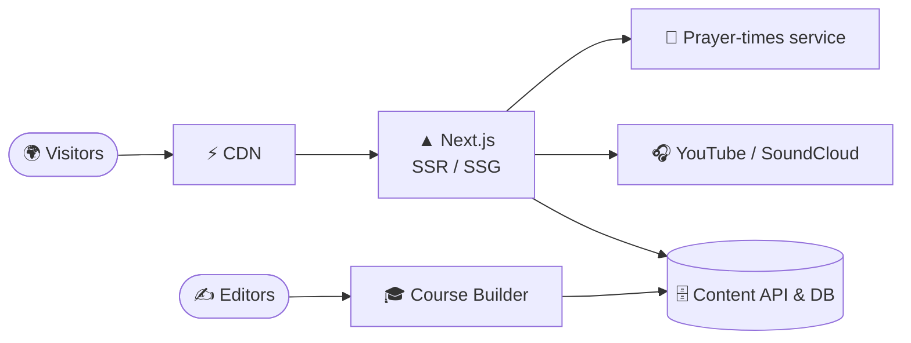
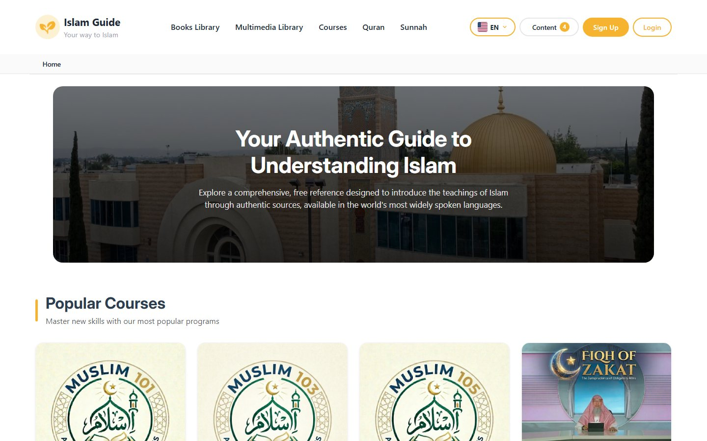
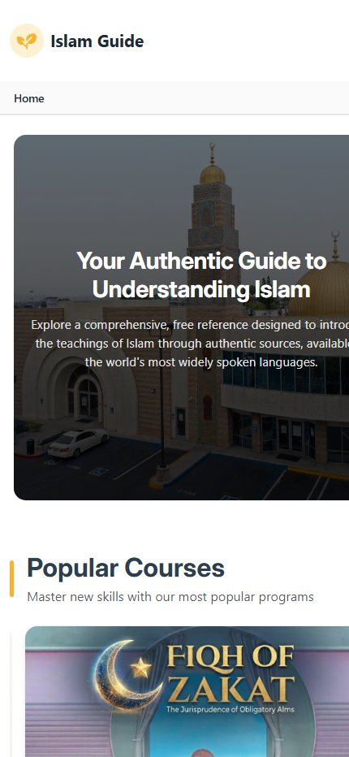

 

> 🔒 **The source code is private** (production / client work). This repository is a case study: what the product does, how it is built, and my role. A code walkthrough is available on request: [abdelqader.pro](https://abdelqader.pro) · [LinkedIn](https://www.linkedin.com/in/abdelqader-al-omari/).

## Overview
A free, comprehensive reference that introduces the teachings of Islam through authentic sources, in widely spoken
languages, built to stay fast and discoverable at scale.

## Key features
- 🎓 **Course Builder LMS**: structured courses (Muslim 101/103/105, Fiqh of Zakat...) built with a course builder
- 📚 **Interactive book readers** in the books library
- 🎧 **Multimedia hub** bringing together YouTube and SoundCloud content
- 🕌 **Location-aware prayer-times dashboard**
- 🌍 **Multilingual** interface and content
- 🔎 **SEO & performance** optimization so the content is found and loads fast

## Architecture

## My role
Full-stack development: architecture, the Next.js front end, the course builder, integrations, and SEO & performance work.

## Tech
   

## Screenshots

 Home: courses, library and multimedia in one place

 Mobile-first layout

---

**Built by [Abdelqader Al-Omari](https://github.com/abdelqader-alomari)** · Senior Full-Stack Engineer · AI & Enterprise Solutions

  

